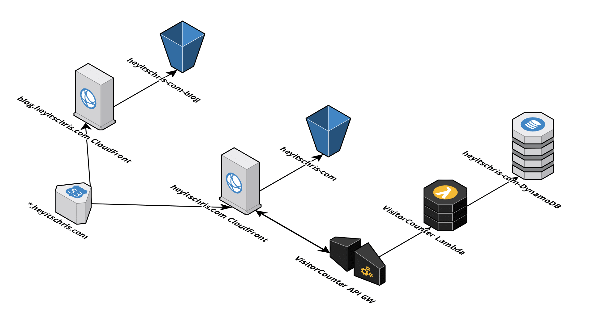

# Info
*Disclaimer: this project was originally made for the [Cloud Resume Challenge](https://cloudresumechallenge.dev/)*

## Architecture Diagram

## Contents
This repository holds the backend code for my personal website [heyitschris.com](https://heyitschris.com).
It includes:
- Service Control Policy for the designated sub-account
- IAM Policy for the `github-ci/cd` user
- A GitHub actions workflow that updates the backend infrastructure
- A SAM/CloudFormation template that describes the backend infrastructure
- Unit test for the VisitorCounter Lambda function
- Misc. objects that were required to transfer the project from my main, to a designated AWS Organizations sub-account.

## Misc.
Originally the domain was bought by an AWS account that turned into an Organizations master account. Therefore the domain needed to be transferred to the designated sub-account. For the process, see the `domainTransfer.md` file.

## CI/CD Workflow
As described in the `.github/workflows/main.yml`, there is a GitHub Actions workflow that is triggered every time there is a push to the master branch. This workflow updates the SAM stack currently deployed. The AWS access keys are stored as GitHub Secrets and the user has very limited access to resources. The SAM Deploy assumes a role to deploy the needed resources. This project is utilizing GitHub Actions over an AWS CodePipeline for cost savings and is a better alternative based on the scope of this project.

## How to deploy
Follow these steps to deploy the static website and all it's components:

1. Make sure [SAM](https://github.com/awslabs/serverless-application-model) is installed and you have configured the credentials for the AWS CLI.
2. Deploy the `heyitschris-com-infra.yaml` template with `sam build && sam deploy -g`. Fill out the parameters to your needs or modify the `config.toml` beforehand.
3. Upload your static website's content to the freshly created, main S3 bucket.
4. In the outputs of the CloudFormation stack, you will find the CloudFront URL of your new website. The API Gateway URL is displayed there as well, make sure to modify your frontend code to reflect the correct endpoint.
5. (Optional) Point your domain's name servers to the freshly created Route53 hosted zone.
